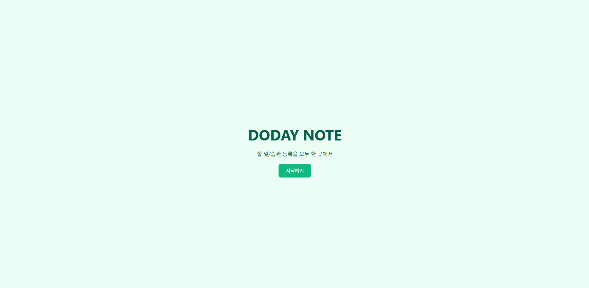
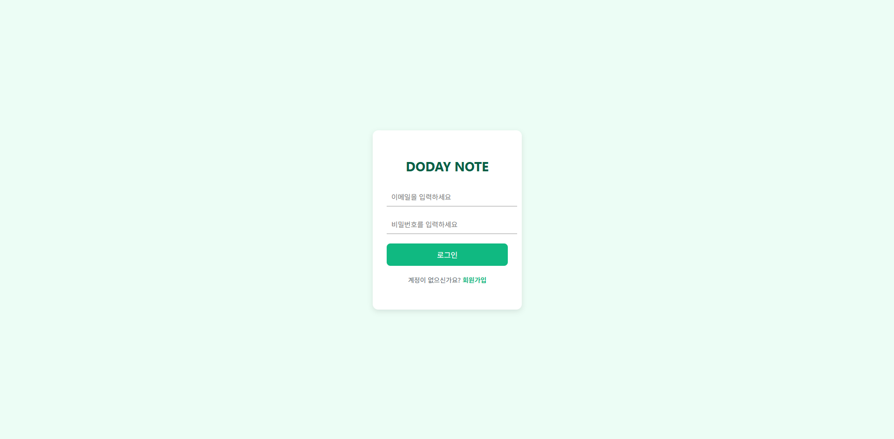
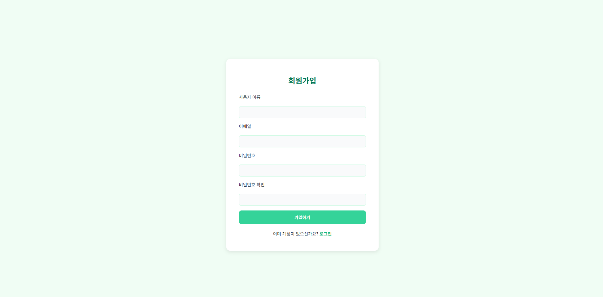
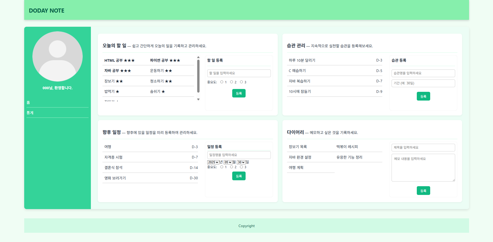
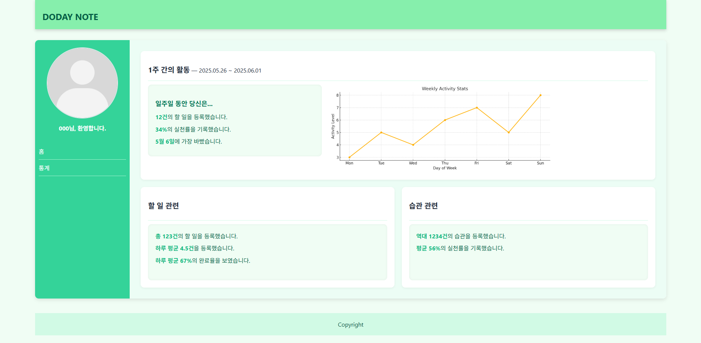

# DODAY NOTE

**DODAY NOTE**는 HTML/CSS로 제작한 일정/습관 관리 홈페이지 입니다.
오늘의 할 일과 매일의 습관을 포괄적으로 관리할 수 있으며, 그 외에도 향후 일정과 다이어리 기능을 제공합니다. 

## 사용 언어
- HTML5
- CSS
- JavaScript(향후 추가 예정)

## 주요 기능
- 쉽고 빠른 할 일 등록
- 기간 단위로 간단하게 습관 등록
- 오늘의 할 일 뿐만 아닌 향후 일정도 등록
- 다이어리를 통한 메모 기능 지원
- 할 일에 중요도를 부여하여 중요한 일정을 더욱 세밀하게 관리 가능.
- 사용자의 할 일/습관 실천 관련 통계를 제공하여 성취감 향상.

## 프로젝트 구조
### imgs
- basic.png
- basic2.png
- chart.png
- home_img.png
- login_img.png
- main_img.png
- ranking_img.png
- signup_img.png
  
### CSS
- home.css
- login.css
- main.css
- ranking.css
- signup.css
  
### html(개별 파일로 저장됨)
- home.html
- login.html
- main.html
- ranking.html
- signup.html
- README.md
  
## UI 이미지
### 홈 화면(home.html)

- 사용자가 접속 시 처음으로 맞이하는 화면

### 로그인 화면(login.html)

- 로그인 기능 제공

### 회원가입 화면(signup.html)

- 신규 사용자 회원 가입 기능 제공

### 메인 화면(main.html)

- 할 일/습관/향후 일정/다이어리 기능을 한 페이지에서 제공

### 통계 화면(ranking.html)

- 일주간/역대 실천한 할 일/습관 관련 통계를 제공.

## 향후 계획
- 전체적인 UI 개선 및 파일 구조 개선
- JavaScript 사용한 페이지 별 동작 구현

## 작성자
- 이름: dgjPolyTech
- Email: dgjPolyTech@gmail.com
